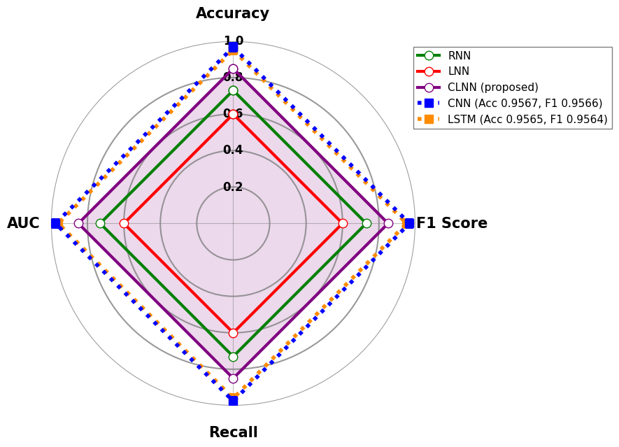
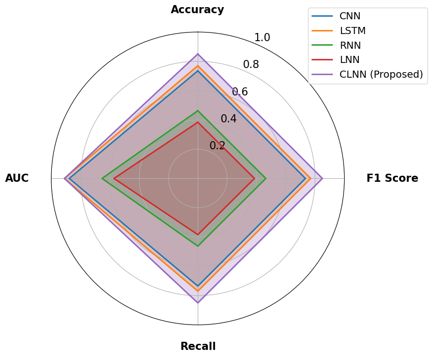

# Lightweight Convolutional Liquid Neural Network for Efficient Classification of Bioacoustic Signals


---

## 📌 Overview
This repository contains the implementation of the **Hybrid Liquid Neural Network (Hybrid LNN)** used in my Master's thesis:  
**"Lightweight Convolutional Liquid Neural Network for Efficient Classification of Bioacoustic Signal"** (2025, Lou Andrei Rabanzo).

The Hybrid LNN combines **1D convolutional feature extraction** with **liquid neurons** to efficiently classify **bee vs. no-bee audio recordings** directly from raw waveforms.  
It achieves competitive performance with **very low parameter count (~3000)**, making it suitable for deployment on **resource-constrained devices**.

---

## 📂 Contents
- `hybrid_lnn_binary.py` → Implementation of Hybrid LNN for bee/no-bee classification  
- `requirements.txt` → Dependencies  
- `README.md` → This document  
- `LICENSE` → License file  

---

## ⚙️ Requirements
- Python 3.9+
- PyTorch
- torchaudio
- scikit-learn
- matplotlib
- numpy
- torchsummary (optional, for model summary)

### Install everything with:

```bash
pip install -r requirements.txt
```
---

## ▶️ How to Run

1.  **Clone the repository:**

    ```bash
    git clone https://github.com/USERNAME/thesis-hybrid-lnn.git
    cd thesis-hybrid-lnn
    ```

2.  **Update the dataset path in `hybrid_lnn_binary.py`:**

    ```python
    DATASET_PATH = "path/to/your/wav/files"
    ```

    The code expects `.wav` audio files named with keywords like **QueenBee** or **No_QueenBee** for automatic labeling.

3.  **Run the script:**

    ```bash
    python hybrid_lnn_binary.py
    ```

This will train and evaluate the Hybrid LNN using **5-fold cross-validation** and output metrics.

---


## 📊 Dataset

The model was evaluated on the ["To Bee or Not to Bee" dataset](https://www.kaggle.com/datasets/chrisfilo/to-bee-or-no-to-bee) and [ASC24 Multiple Animal Classification](https://www.kaggle.com/datasets/haithammoh/sounds-of-animals)

> Note: Dataset files are not included in this repository due to size. Please download and place them in your chosen `DATASET_PATH`.

---

## 📈 Results
Bee Classification (h=40 and h=60)
* **Accuracy:** ~95%
* **F1-score:** ~95%



The CLNN model (89.57% accuracy, 89.58% F1-score) significantly out-
performs raw-audio baselines (RNN and LNN) by effectively combining convolutional
feature extraction with liquid neuron dynamics, bridging the performance gap with high-
performing spectrogram-based models (CNN and LSTM).

To acquire more understanding into the efficiency–accuracy trade-off in the proposed
CLNN architecture, additional analysis was performed through adjusting the hidden-
layer size (h). This scaling study provides insight into the effects of model capacity on
learning stability, inference efficiency, and classification performance, thus identifying the
configuration that increases representational power while reducing computational cost.


As the h increases from 8 to 40, performance goes up quickly, then levels off at h=60.
In this range (∼3.0–3.4k parameters), the CLNN model performs almost equally to the
spectrogram-based CNN and LSTM models, even though it only needs about one-tenth of the parameters they require. Beyond h=80, improvements in accuracy tends to slow down and F1-scores go down a little, which relatively suggests that the model is maybe
too powerful for the dataset’s complexity. This pattern shows the best balance between
capacity and regularization, where the hybrid design gets the most representational power
without overfitting.


Multi Animal classification (h=8)
* **Accuracy:** ~85%
* **F1-score:** ~85%



The Hybrid LNN approaches CNN/LSTM performance while being >10x smaller in parameters.

---

## 📖 Citation

If you use this repository, please cite:

Lou Andrei Rabanzo. "Lightweight Convolutional Liquid Neural Network for Efficient Classification of Bioacoustic Signal." Master's Thesis, 2025.

Repository: https://github.com/louandrei/Lightweight-Convolutional-Liquid-Neural-Network-for-Efficient-Classification-of-Bioacoustic-Signal
